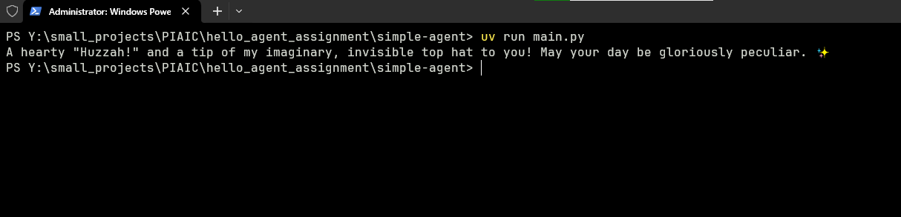

# Simple Hello Agent

## Screenshots

## Usage
 - `git clone https://github.com/umar-mq/hello_agent_assignment.git`
 - `cd hello_agent_assignment/simple-agent`
 - `uv sync --frozen`
 - `uv run main.py`